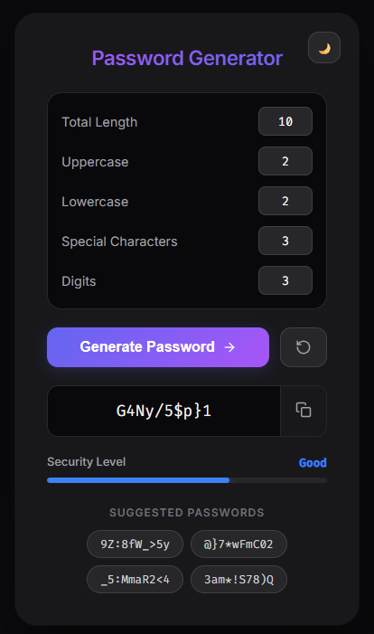
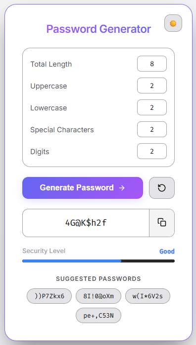

# Password Generator

A modern and interactive password generator built using HTML, CSS, and JavaScript. This application allows users to generate secure passwords with precise control over character composition, along with a clean user interface and smooth animations.

### App Preview

| Dark Mode | Light Mode |
| :---: | :---: |
|  | 

## Features

* Custom password generation based on:

  * Total length
  * Uppercase letters
  * Lowercase letters
  * Special characters
  * Digits
* Real-time validation for input consistency
* Animated password reveal effect
* Password strength indicator (Weak, Good, Strong)
* Suggested alternative passwords
* Copy to clipboard functionality
* Reset functionality for quick reconfiguration
* Toast notifications for user actions and errors
* Light and Dark theme toggle

## Tech Stack

* **HTML5:** Semantic structure
* **CSS3:** Custom properties, keyframe animations, and flexbox layouts
* **JavaScript (Vanilla):** Core logic, array shuffling, and DOM manipulation

## Project Structure

```
.
├── assets/         # Contains README images
├── index.html
├── style.css
├── script.js
├── README.md
└── .gitignore
```

## How to Run

1. Clone or download the repository
2. Open `index.html` in any modern browser
3. No additional setup or installation is required

## Notes

This is a fully client-side application. All logic runs in the browser without any backend or external APIs.

## License

This project is open source and available for personal and educational use.
